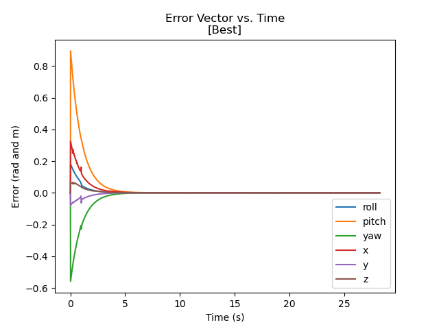
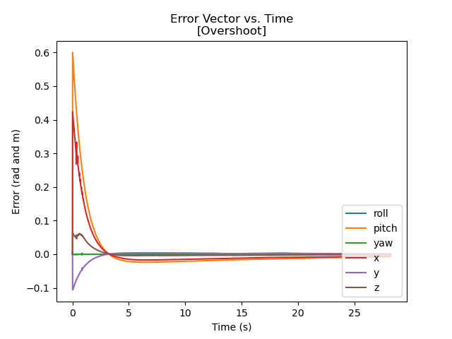
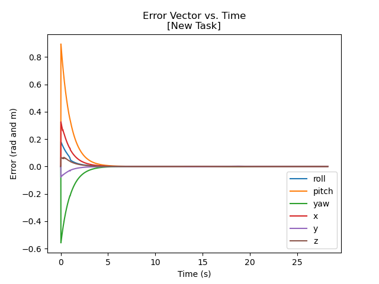

# MECH 449 Final Project
### Description:
For the final procject of MECH 449 robotic manipulation we were tasked with writing a controller to plan both chassis and arm movements of a mobile manipulator movement. The control scheme aims to minimize error, where error is the distance from the current arm and chassis locations to the "perfect" arm and chassis locations. 

## Different types of control schemes

### Best
The best control scheme is an attempt to minimize error without having any overshoot.

### Overshoot
The overshoot control scheme attemps to correct error too fast, so the robot overshoots the perfect path location for that specific time. This can be seen around t = 3 seconds where the error goes beyond 0 into the negative.

### New Task
The new task control scheme is trying to accomplish the goal as fast as possible but without any overshoot just like the best scheme, but this goal has different starting and ending locations for the cube. Different starting and ending locations require different tuning parameters.

