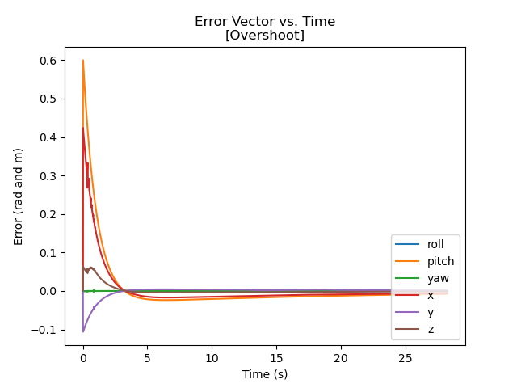
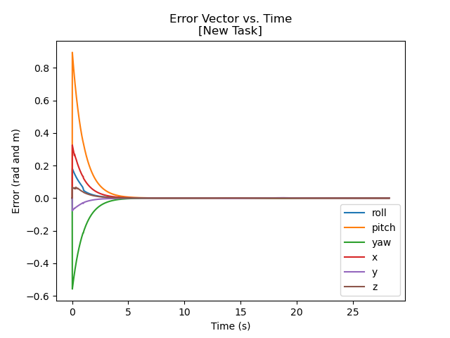

## Best parameters
P controller  
Kp = 1.0  
Ki = 0.0  

## Overshoot parameters  
PI controller  
Kp = 1.0  
Ki = 0.1

  

## New task parameters  
Cube starting position  
x: 0.5 y: 0.5 phi: 0  
Cube final position  
x: -0.5 y: -1 phi: -1.570796

PI controller
Kp = 1.0  
Ki = 0.0

